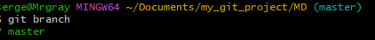
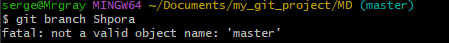
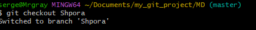
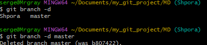
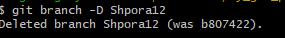
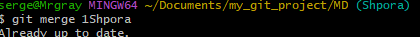

# Инструкция по работе с Git
## Что такое Git?
__*Git*__ - cистема управления версиями, которая отслеживает историю изменений в процессе совместной работы над проектами. По мере того как разработчики вносят изменения в проект, в любое время можно восстановить любую более раннюю его версию.
## Подготовка программного обеспечения
* Скачать и установить **Visual Studio Code** [перейти на сайт](https://code.visualstudio.com/)
* Скачать и установить **Git** [перейти на сайт](https://git-scm.com/downloads)
* Запустить **Visual Studio Code**, запустить терминал
* Проверить (кооректность установки) версию установленного **Git** командой ```git --version```
* После установки необходимо «представиться» системе контроля версий:<br>
```git config --global user.name «Ваше имя английскими буквами»```<br>
```git config --global user.email ваша почта@example.com```<br>
## Подготовка репозитория
* Создать папку в необходимом репозитории компьютера
* Перейти с помощью проводника в **Visual Studio Code** в созданную папку
* Инициализировать репозиторий в терминале командой ```git init```
## Создание коммитов
### Git add
Для добавление изменений в коммит используется команда ```git add``` и имя файла<br>
Например, ```git add README.md```
### Оправить коммит
```git commit -m "first commit"``` - команда для отправки коммита<br>
* ```git commit``` - обращение к **GIT**
* ```-m``` - добавить сообщение *(коментарий)*
* ```"first commit"``` - коментрарий *(в кавычках)*
### Посмотреть список коммитов
* ```git log``` - стандартный вид
* ```git log --graph``` - вид с графическим отображением веток
### Перейти к сохранению
* ```git checkout```
* ```git checkout <номер коммита, первые 4 символа>``` - перейти к определенному изменению
* ```git master``` - перейти к изменению последнего коммита
### Посмотреть есть ли не сохранненные изменения репозитория (файлов)
* ```get status```

## Работа с ветками
* ```git branch``` - посмотреть список веток


* ```git branch <название ветки>``` - создать ветку (новая ветка унаследует коммиты родительской ветки)


* ```git checkout <название ветки>``` - перейти на ветку


* ```git branch -d <название ветки>``` - удалить ветку после merge


* ```git branch -D <название ветки>``` - удалить ветку принудительно


* ```git merge <название сливаемой ветки>``` - сливание веток



## Работа с удаленными репозиториями

- `git clone <URL>` — клонирование репозитория
- `git remote add origin <URL>` — добавление удаленного репозитория
- `git push origin main` — отправка изменений
- `git pull origin main` — получение изменений
- `git fetch` — проверка обновлений без слияния
- `git merge origin/main` — слияние изменений

